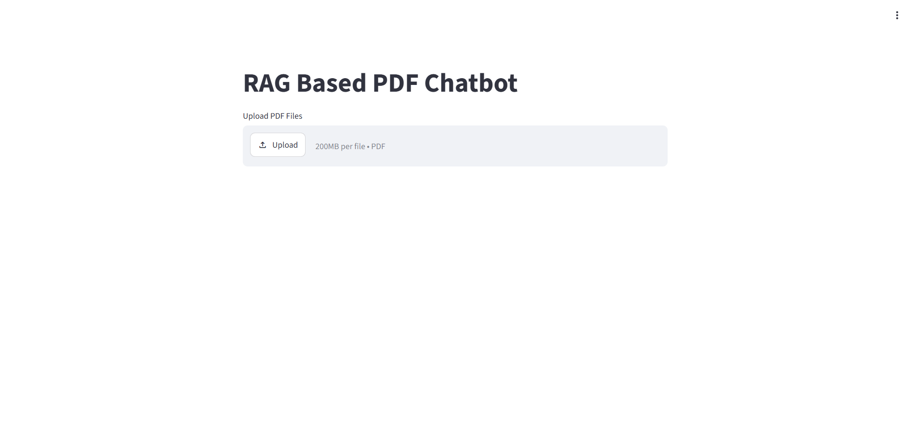
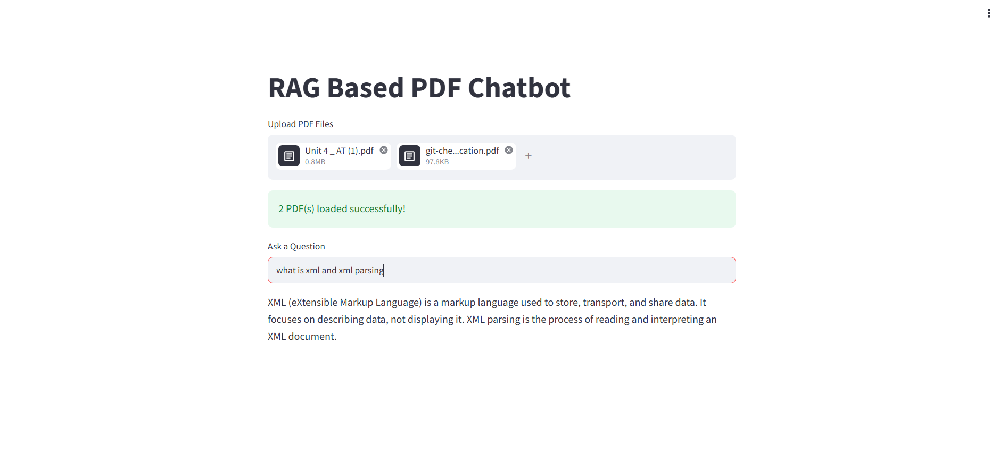

# RAG-PDF-Chatbot

A conversational AI chatbot that answers user queries based on the content of uploaded PDF documents using **Retrieval-Augmented Generation (RAG)**. The chatbot retrieves relevant information from uploaded PDFs using semantic search and generates context-aware answers with **Google Gemini**. It also maintains conversational context to understand follow-up questions within the same chat session.

---

##  Project Overview

Traditional Large Language Models (LLMs) may generate inaccurate or hallucinated responses when asked questions about specific documents. This project solves that problem by implementing **Retrieval-Augmented Generation (RAG)**, where relevant information is first retrieved from uploaded PDF documents and then provided to the Gemini model as context before generating a response.

Users can:

* Upload one or multiple PDF documents.
* Ask natural language questions about the uploaded documents.
* Receive answers grounded in the document content.
* Continue the conversation with follow-up questions using chat history.

---

##  Features

*  Upload one or multiple PDF documents
*  Automatic PDF text extraction
*  Intelligent document chunking
*  Semantic embeddings using Sentence Transformers
*  FAISS vector database for similarity search
*  Context-aware answer generation using Google Gemini
*  Multi-turn conversational memory
*  Answers generated only from retrieved document context
*  Interactive Streamlit web interface
*  Fast semantic document retrieval

---

##  Tech Stack

| Category                | Technology                               |
| ----------------------- | ---------------------------------------- |
| Programming Language    | Python                                   |
| Frontend                | Streamlit                                |
| LLM                     | Google Gemini 2.5 Flash                  |
| Framework               | LangChain                                |
| Document Loader         | PyPDFLoader                              |
| Text Splitting          | RecursiveCharacterTextSplitter           |
| Embedding Model         | Sentence Transformers (all-MiniLM-L6-v2) |
| Vector Database         | FAISS                                    |
| PDF Processing          | PyPDF                                    |
| Development Environment | Google Colab                             |
| Version Control         | Git & GitHub                             |

---

##  System Architecture

```text
                Upload PDF(s)
                      │
                      ▼
              PyPDFLoader
                      │
                      ▼
          Extract Text from PDF
                      │
                      ▼
     Recursive Character Text Splitter
                      │
                      ▼
       Sentence Transformer Embeddings
                      │
                      ▼
             FAISS Vector Database
                      │
        User asks a Question
                      │
                      ▼
         Similarity Search (Top-K)
                      │
                      ▼
     Retrieved Context + Chat History
                      │
                      ▼
           Google Gemini LLM
                      │
                      ▼
            Generated Response
```

---

##  RAG Workflow

1. User uploads one or more PDF documents.
2. PDF text is extracted using **PyPDFLoader**.
3. The extracted text is divided into smaller chunks using **RecursiveCharacterTextSplitter**.
4. Each chunk is converted into a vector embedding using the **all-MiniLM-L6-v2 Sentence Transformer** model.
5. The embeddings are stored in a **FAISS Vector Database**.
6. When a user asks a question:

   * The question is converted into an embedding.
   * FAISS retrieves the most relevant document chunks.
7. The retrieved context and conversation history are sent to **Google Gemini**.
8. Gemini generates an answer based only on the retrieved document context.
9. The response is displayed in the Streamlit chatbot interface.

---

## Project Structure

```text
RAG-PDF-Chatbot/
│
├── app.py
├── requirements.txt
├── README.md
├── .gitignore
├── notebook/
│   └── RAG_PDF_Chatbot.ipynb
├── screenshots/
│   ├── home.png
│   ├── upload.png
│   ├── answer.png
│   
└── sample_documents/
```

---

##  Installation

### 1. Clone the Repository

```bash
git clone https://github.com/your-username/RAG-PDF-Chatbot.git
```

### 2. Navigate to the Project Directory

```bash
cd RAG-PDF-Chatbot
```

### 3. Install Dependencies

```bash
pip install -r requirements.txt
```

### 4. Configure Gemini API Key

Set your Gemini API key as an environment variable or replace the placeholder in the code with your own key.

```python
genai.configure(api_key="YOUR_GEMINI_API_KEY")
```

### 5. Run the Application

```bash
streamlit run app.py
```

The application will open in your browser.

---

##  How to Use

1. Launch the Streamlit application.
2. Upload one or multiple PDF documents.
3. Wait for document processing to complete.
4. Enter your question in the chatbot.
5. View the generated response.
6. Continue asking follow-up questions within the same session.

---

## 📸 Screenshots


### Home Page




### Upload PDF


### Generated Answer



---

##  Requirements

* Python 3.10+
* Streamlit
* LangChain
* LangChain Community
* LangChain Text Splitters
* Google Generative AI
* Sentence Transformers
* FAISS
* PyPDF
* Transformers
* Torch

---

##  Future Enhancements

* Support for DOCX, TXT, and PPT documents.
* Persistent chat history across sessions.
* Citation of source pages for each answer.
* Hybrid retrieval using keyword search and vector search.
* Summarization of uploaded documents.
* OCR support for scanned PDFs.
* User authentication and document management.
* Deployment on Streamlit Community Cloud or Hugging Face Spaces.
* Docker containerization for easier deployment.
* Integration with cloud vector databases such as Pinecone or ChromaDB.

---

##  Author

**Jay Desai**

BE Computer Engineering

AI/ML Enthusiast

---

##  License

This project is intended for educational and internship purposes. Feel free to use and modify it for learning and research.
